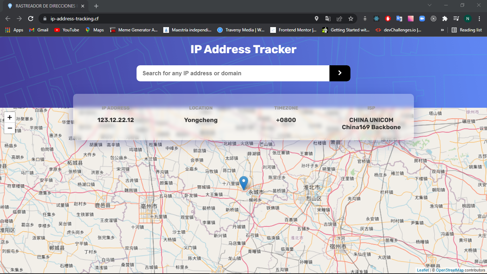
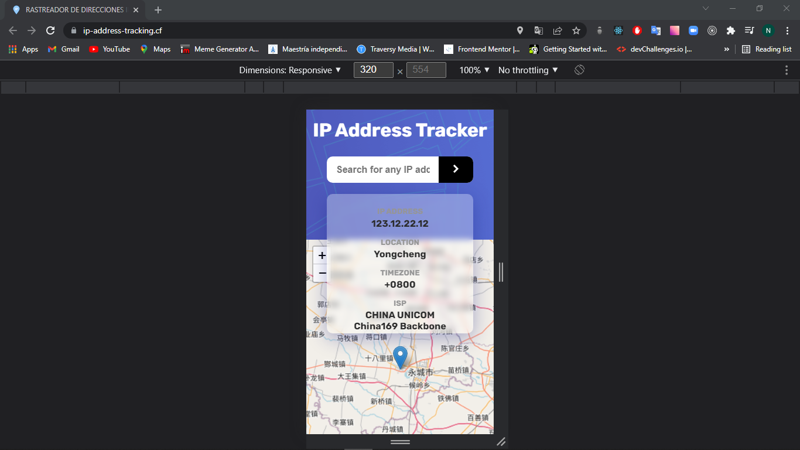

# IP ADDRESS TRACKER
Esta es la solucion a [IP address tracker challenge on Frontend Mentor](https://www.frontendmentor.io/challenges/ip-address-tracker-I8-0yYAH0). Los desafíos de Frontend Mentor ayudan a mejorar las habilidades de codificación mediante la construcción de proyectos realistas. 

## TABLA DE CONTENIDOS

- [IP ADDRESS TRACKER](#ip-address-tracker)
  - [TABLA DE CONTENIDOS](#tabla-de-contenidos)
    - [DESAFIO](#desafio)
    - [SCREENSHOTS](#screenshots)
    - [LINKS](#links)
    - [TECNOLOGIAS](#tecnologias)
    - [RECURSOS UTILES](#recursos-utiles)
  - [AUTOR](#autor)

### DESAFIO

Los usuarios deben ser capaces de : 

- Ver el diseño óptimo de cada página en función del tamaño de la pantalla de su dispositivo.
- Ver el estado de los elementos interactivos de la página al pasar por encima de ellos.
- Ver su propia dirección IP en el mapa en la carga inicial de la página.
- Buscar cualquier dirección IP o dominio y ver la información clave y la ubicación.

### SCREENSHOTS

### LINKS

- Solucion URL: [GITHUB](https://github.com/NicolasGula/ip-address-tracking)
- Live Site URL: [IP ADDRESS TRACKING](https://ip-address-tracking.cf/)

### TECNOLOGIAS

- HTML5 
- CSS , SASS
- Mobile-first workflow
- [React](https://reactjs.org/) - JS library
- [Vite](https://vitejs.dev/) - Vite
Next Generation Frontend Tooling
- [React Leaflet](https://react-leaflet.js.org/) - React components for Leaflet maps
-  [ipdata](https://ipdata.co/) - IP Geolocation and
Proxy Detection API.

### RECURSOS UTILES

- [DESPLEGAR EL MAPA CORRECTAMENTE](https://stackoverflow.com/questions/40365440/react-leaflet-map-not-correctly-displayed).
- [DIFERENTES TILES DE OPENSTREETMAP](https://wiki.openstreetmap.org/wiki/Tiles).
- [HACER VISIBLE EL ICONO](https://stackoverflow.com/questions/49441600/react-leaflet-marker-files-not-found).
- [UBICAR EL MAPA EN LA POSICION ACTUAL REACT-LEAFLET](https://stackoverflow.com/questions/65979955/how-to-set-the-map-to-a-geolocation-on-map-load-with-react-leaflet-v3).
- [UBICAR EL MAPA EN LA POSICION ACTUAL REACT-LEAFLET SANDBOX](https://codesandbox.io/s/how-to-set-the-map-to-a-geolocation-on-map-load-with-react-leaflet-v3-uvkpz?file=/src/Maps.jsx).
- [INMUTABILIDAD MAP CONTAINER](https://stackoverflow.com/questions/65894789/react-leaflet-map-center-not-changing).
- [REGEX VALIDAR IPV4 E IPV6](https://stackoverflow.com/questions/23483855/javascript-regex-to-validate-ipv4-and-ipv6-address-no-hostnames).

## AUTOR

- Website - [Nicolas Gula](https://www.nicolasgula.tk)

